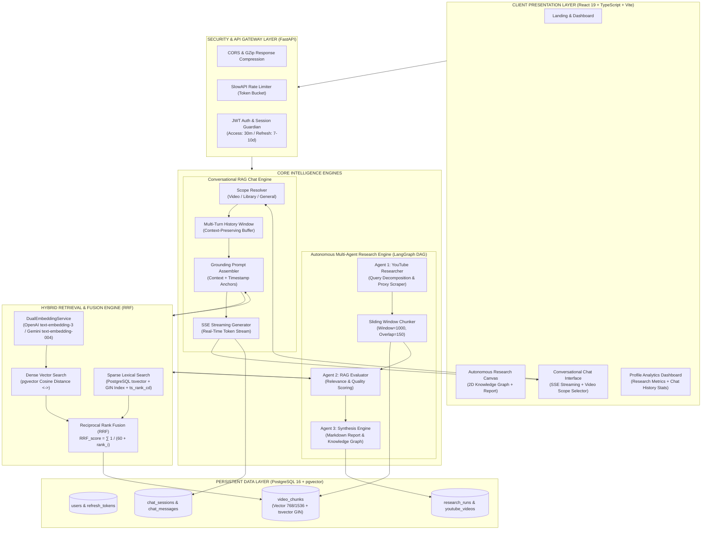
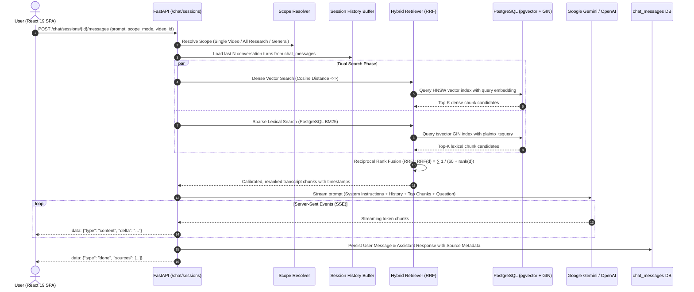
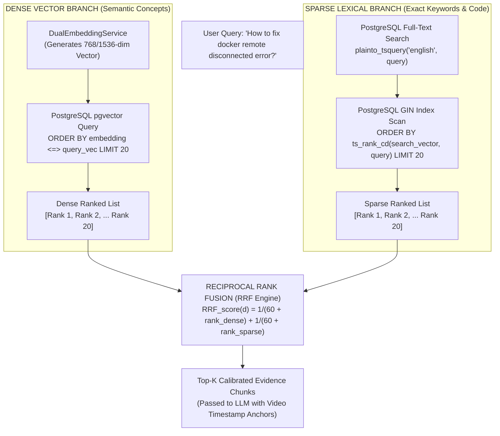

# ResearchTube 🎓🤖

> **Automated Multi-Agent YouTube Research Platform**
> Transform raw YouTube video streams into structured, publication-grade research reports using **LangGraph autonomous agents**, **PostgreSQL pgvector RAG**, and **Google Gemini 3.5**.

---

## Project Overview

Technical YouTube content including architecture lectures, conference talks, and deep-dive coding tutorials contains invaluable engineering knowledge. However, accessing and leveraging this knowledge presents major hurdles:
- **Time Inefficiency:** Manually watching multiple 45-minute technical lectures to locate specific code implementations is slow and tedious.
- **Low Signal-to-Noise Ratio:** Traditional keyword searches cannot evaluate code quality, tutorial rigor, or technical depth.
- **Shallow Single-Mode Retrieval:** Pure vector search misses exact CLI flags and syntax, while pure keyword search misses conceptual synonyms.
- **Lack of Persistent Grounding:** Notes taken manually lack semantic indexing and cannot be queried conversationally across hundreds of hours of video.

**ResearchTube** solves these problems by providing a unified, dual-engine AI platform:
1. **Autonomous Multi-Agent Research Engine:** A 7-node LangGraph DAG orchestrates 3 specialized agents to decompose topics, crawl YouTube across a 3-layer proxy mesh, chunk and embed transcripts, evaluate content quality via hybrid RAG, and synthesize publication-grade technical markdown reports with interactive 2D knowledge graphs.
2. **Conversational Video RAG Assistant:** An interactive, multi-turn chat service allowing users to converse directly with researched videos. Powered by real-time Server-Sent Events (SSE) token streaming, dynamic scope resolution (`video`, `run`, `none`), multi-turn history buffers, and timestamped video citations.
3. **PostgreSQL 16 Hybrid Retrieval Engine:** Unifies Dense Vector Search (`pgvector` Cosine Distance `<=>`) with Sparse Lexical Search (`tsvector` + GIN Index + `ts_rank_cd`), merging candidate rankings via Reciprocal Rank Fusion (RRF, $k=60$) for mathematically optimal retrieval accuracy.

---

##  Running Frontend & Backend (Setup Documentation)

For detailed installation instructions, environment variables configuration, local development setups, and subsystem architecture specs, refer to the respective subsystem documentation:

*  **[Backend Documentation & Setup Guide](backend/README.md):** Complete guide for installing Python 3.12 dependencies, setting up `.env` secret keys, initializing PostgreSQL `pgvector` schemas, running FastAPI servers, and exploring interactive Swagger API docs.
*  **[Frontend Documentation & Setup Guide](frontend/README.md):** Complete guide for setting up React 19 SPA, Node.js dependencies, Vite build configurations, Tailwind CSS v4 styling, component hierarchy, and routing.

---
## Visual System Architecture Map & Data Flow

ResearchTube is powered by a high-throughput, dual-engine backend supporting both **Autonomous Multi-Agent YouTube Research** and **Conversational Video RAG Chat**, unified by a **PostgreSQL 16 + pgvector Hybrid Search (BM25 + Dense Vectors via Reciprocal Rank Fusion)** engine.

### 1. Unified End-to-End System Architecture

```mermaid
flowchart TD
    subgraph Client[" CLIENT PRESENTATION LAYER (React 19 + TypeScript + Vite)"]
        UI_Home["Landing & Dashboard"]
        UI_Research["Autonomous Research Canvas\n(2D Knowledge Graph + Report)"]
        UI_Chat["Conversational Chat Interface\n(SSE Streaming + Video Scope Selector)"]
        UI_Profile["Profile Analytics Dashboard\n(Research Metrics + Chat History Stats)"]
    end

    subgraph Security[" SECURITY & API GATEWAY LAYER (FastAPI)"]
        CORS["CORS & GZip Response Compression"]
        RateLimit["SlowAPI Rate Limiter (Token Bucket)"]
        JWT["JWT Auth & Session Guardian\n(Access: 30m / Refresh: 7-10d)"]
    end

    subgraph DualEngines[" CORE INTELLIGENCE ENGINES"]
        subgraph ResearchEngine[" Autonomous Multi-Agent Research Engine (LangGraph DAG)"]
            AG1["Agent 1: YouTube Researcher\n(Query Decomposition & Proxy Scraper)"]
            Chunker["Sliding Window Chunker\n(Window=1000, Overlap=150)"]
            AG2["Agent 2: RAG Evaluator\n(Relevance & Quality Scoring)"]
            AG3["Agent 3: Synthesis Engine\n(Markdown Report & Knowledge Graph)"]
        end

        subgraph ChatEngine[" Conversational RAG Chat Engine"]
            ScopeHandler["Scope Resolver\n(Video / Library / General)"]
            HistoryBuffer["Multi-Turn History Window\n(Context-Preserving Buffer)"]
            PromptAssembler["Grounding Prompt Assembler\n(Context + Timestamp Anchors)"]
            SSEStream["SSE Streaming Generator\n(Real-Time Token Stream)"]
        end
    end

    subgraph HybridEngine[" HYBRID RETRIEVAL & FUSION ENGINE (RRF)"]
        DualEmbed["DualEmbeddingService\n(OpenAI text-embedding-3 / Gemini text-embedding-004)"]
        DenseSearch["Dense Vector Search\n(pgvector Cosine Distance <->)"]
        BM25Search["Sparse Lexical Search\n(PostgreSQL tsvector + GIN Index + ts_rank_cd)"]
        RRF["Reciprocal Rank Fusion (RRF)\nRRF_score = ∑ 1 / (60 + rank_i)"]
    end

    subgraph Storage[" PERSISTENT DATA LAYER (PostgreSQL 16 + pgvector)"]
        DB_Users[("users & refresh_tokens")]
        DB_Research[("research_runs & youtube_videos")]
        DB_Chunks[("video_chunks\n(Vector 768/1536 + tsvector GIN)")]
        DB_Chat[("chat_sessions & chat_messages")]
    end

    Client --> Security
    Security --> DualEngines

    %% Research Flow
    AG1 --> Chunker
    Chunker --> DB_Chunks
    Chunker --> AG2
    AG2 --> HybridEngine
    HybridEngine --> AG2
    AG2 --> AG3
    AG3 --> DB_Research

    %% Chat Flow
    UI_Chat --> ScopeHandler
    ScopeHandler --> HistoryBuffer
    HistoryBuffer --> PromptAssembler
    PromptAssembler --> HybridEngine
    HybridEngine --> PromptAssembler
    PromptAssembler --> SSEStream
    SSEStream --> UI_Chat
    SSEStream --> DB_Chat

    %% Hybrid Search Flow
    DualEmbed --> DenseSearch
    DenseSearch --> RRF
    BM25Search --> RRF
    RRF --> DB_Chunks
```

---

### 2. Autonomous Multi-Agent Research Workflow (7-Node LangGraph DAG)

When a user initiates an autonomous research run, ResearchTube executes a cyclic state-machine across 3 specialized agents and 7 discrete pipeline nodes:

```mermaid
flowchart LR
    Start([ User Query]) --> N1["Node 1: Validator\n(Sanitize Query & Quotas)"]
    N1 --> N2["Node 2: Query Planner\n(Agent 1: 3-5 Sub-queries)"]
    N2 --> N3["Node 3: YouTube Crawler\n(3-Layer Proxy Mesh & Metadata)"]
    N3 --> N4["Node 4: Transcript Chunker\n(Sliding Window: W=1000, O=150)"]
    N4 --> N5["Node 5: Hybrid RAG Evaluator\n(Agent 2: Dense + BM25 Scoring)"]
    N5 --> N6["Node 6: Synthesizer Engine\n(Agent 3: Markdown & Knowledge Graph)"]
    N6 --> N7["Node 7: Transactional Persistence\n(PostgreSQL Atomic Commit)"]
    N7 --> Done([ Publication-Ready Report & 2D Graph])

    classDef agent fill:#161616,stroke:#333333,stroke-width:1px,color:#ffffff;
    classDef node fill:#111111,stroke:#262626,stroke-width:1px,color:#cccccc;
    class N2,N3,N5,N6 agent;
    class N1,N4,N7 node;
```

1. **Node 1 (Validator):** Validates and sanitizes input queries, checking rate limits and system load.
2. **Node 2 (Query Planner - Agent 1):** Breaks the overarching topic into 3–5 targeted search terms targeting technical deep dives, architectural breakdowns, and implementation code.
3. **Node 3 (YouTube Crawler - Agent 1):** Scrapes video metadata via YouTube Data v3 API and extracts transcripts across a 3-layer proxy resilience mesh (Webshare residential proxies, environment proxy fallbacks, sequential language tags).
4. **Node 4 (Transcript Chunker):** Splits transcripts into 1,000-character windows with a 150-character overlap to preserve semantic context across chunk boundaries.
5. **Node 5 (Hybrid RAG Evaluator - Agent 2):** Embeds chunks, performs hybrid search, and grades videos on relevance score (0–10), educational quality (0–10), topic coverage (0–10), and beginner friendliness.
6. **Node 6 (Synthesizer Engine - Agent 3):** Synthesizes top video evidence into a publication-grade Markdown research report featuring key concepts, methodology limitations, step-by-step learning paths, and 2D knowledge graph nodes.
7. **Node 7 (Persistence):** Atomically commits research runs, videos, chunks, evaluations, and final reports to PostgreSQL within a single managed transaction.

---

### 3. Conversational RAG Chat Workflow & Streaming Architecture

The conversational engine allows users to query researched materials with full conversation history and grounded video evidence:

```mermaid
sequenceDiagram
    autonumber
    actor User as  User (React 19 SPA)
    participant ChatAPI as  FastAPI (/chat/sessions)
    participant Scope as  Scope Resolver
    participant History as  Session History Buffer
    participant Hybrid as  Hybrid Retriever (RRF)
    participant PG as  PostgreSQL (pgvector + GIN)
    participant LLM as  Google Gemini / OpenAI
    participant DB as  chat_messages DB

    User->>ChatAPI: POST /chat/sessions/{id}/messages (prompt, scope_mode, video_id)
    ChatAPI->>Scope: Resolve Scope (Single Video / All Research / General)
    ChatAPI->>History: Load last N conversation turns from chat_messages
    
    par Dual Search Phase
        ChatAPI->>Hybrid: Dense Vector Search (Cosine Distance <->)
        Hybrid->>PG: Query HNSW vector index with query embedding
        PG-->>Hybrid: Top-K dense chunk candidates
    and
        ChatAPI->>Hybrid: Sparse Lexical Search (PostgreSQL BM25)
        Hybrid->>PG: Query tsvector GIN index with plainto_tsquery
        PG-->>Hybrid: Top-K lexical chunk candidates
    end

    Hybrid->>Hybrid: Reciprocal Rank Fusion (RRF): RRF(d) = ∑ 1 / (60 + rank(d))
    Hybrid-->>ChatAPI: Calibrated, reranked transcript chunks with timestamps

    ChatAPI->>LLM: Stream prompt (System Instructions + History + Top Chunks + Question)
    
    loop Server-Sent Events (SSE)
        LLM-->>ChatAPI: Streaming token chunks
        ChatAPI-->>User: data: {"type": "content", "delta": "..."}
    end

    ChatAPI->>DB: Persist User Message & Assistant Response with Source Metadata
    ChatAPI-->>User: data: {"type": "done", "sources": [...]}
```

---

### 4. Hybrid Search Engine: BM25 + Dense Embeddings + Reciprocal Rank Fusion (RRF)

Traditional vector search often fails on exact keyword identifiers, CLI commands, package names (e.g., `docker compose up --build`), and function signatures. Pure keyword search fails on synonyms, high-level conceptual questions, and paraphrased explanations.

ResearchTube implements **Hybrid Search** combining dense vector semantics with sparse full-text lexical matching:

```mermaid
flowchart TD
    Q["User Query: 'How to fix docker remote disconnected error?'"]

    subgraph DenseBranch[" DENSE VECTOR BRANCH (Semantic Concepts)"]
        Emb["DualEmbeddingService\n(Generates 768/1536-dim Vector)"]
        HNSW["PostgreSQL pgvector Query\nORDER BY embedding <=> query_vec LIMIT 20"]
        DenseList["Dense Ranked List\n[Rank 1, Rank 2, ... Rank 20]"]
        Emb --> HNSW --> DenseList
    end

    subgraph SparseBranch[" SPARSE LEXICAL BRANCH (Exact Keywords & Code)"]
        FTS["PostgreSQL Full-Text Search\nplainto_tsquery('english', query)"]
        GIN["PostgreSQL GIN Index Scan\nORDER BY ts_rank_cd(search_vector, query) LIMIT 20"]
        SparseList["Sparse Ranked List\n[Rank 1, Rank 2, ... Rank 20]"]
        FTS --> GIN --> SparseList
    end

    DenseList --> RRFMerge[" RECIPROCAL RANK FUSION (RRF Engine)\nRRF_score(d) = 1/(60 + rank_dense) + 1/(60 + rank_sparse)"]
    SparseList --> RRFMerge

    RRFMerge --> FinalTopK[" Top-K Calibrated Evidence Chunks\n(Passed to LLM with Video Timestamp Anchors)"]
```

#### Why Hybrid Search Wins:
* **Dense Vectors (`pgvector`):** Matches high-level concepts, architectural semantics, and paraphrased descriptions using Cosine Distance (`<=>`).
* **Sparse Lexical Search (`tsvector` + GIN):** Guarantees pinpoint retrieval of exact error messages, terminal commands, library names, and code tokens using Cover Density ranking (`ts_rank_cd`).
* **Reciprocal Rank Fusion (RRF, $k=60$):** Merges independent ranking spaces without requiring fragile score normalization or artificial weighting parameters.

---

##  Detailed Technology Stack

| Layer | Technology | Technical Purpose & Implementation Details |
| :--- | :--- | :--- |
| **Agent Orchestration** | **LangGraph** | Manages a 7-node cyclic state-machine DAG with typed state pass-through (`ResearchState`), checkpointing, and agent coordination. |
| **Dual Intelligence Engines** | **FastAPI + Async Python 3.12** | Powers asynchronous execution for both the autonomous multi-agent research pipeline and the conversational chat streaming engine. |
| **Hybrid Search & Fusion** | **PostgreSQL 16 + pgvector + RRF** | Combines 768-dim dense vectors (`<=>` Cosine Distance) and sparse lexical search (`tsvector` + GIN index + `ts_rank_cd`) fused via Reciprocal Rank Fusion ($k=60$). |
| **Embeddings Pipeline** | **DualEmbeddingService** | Multi-provider embedding architecture using OpenAI `text-embedding-3-small` (primary) with automated fallback to Google `text-embedding-004`. |
| **Language Models** | **Google Gemini 3.5 Flash & OpenAI** | Synthesizes technical research reports, evaluates video technical depth/pros/cons, and streams conversational RAG answers. |
| **Conversational Streaming** | **Server-Sent Events (SSE)** | Streams token deltas (`event: delta`) with source citations (`event: sources`), session history buffering, and dynamic scope resolution. |
| **Frontend Presentation** | **React 19 + TypeScript + Vite** | High-performance SPA built with strict TypeScript, React Router v6, Lucide icons, and optimized Vite module bundling. |
| **Design System & Styling** | **Tailwind CSS v4** | Dark glassmorphic aesthetic, custom keyframe micro-animations, responsive mobile drawer navigation, and Space Grotesk typography. |
| **Anti-Block Proxy Mesh** | **Webshare Residential Proxies** | 3-layer proxy scraper mesh with residential authentication pools, environment proxy injection, and sequential language tag scanning. |
| **Security & Rate Limiting** | **JWT + Argon2 + SlowAPI** | Sliding session management (30m access / 7–10d refresh tokens), Argon2 password hashing, and token-bucket rate limiting. |
| **Containerization** | **Docker & Docker Compose** | Multi-container orchestrated development and deployment connecting Frontend, FastAPI backend, and PostgreSQL with pgvector. |

---

##  Core System Capabilities

* **7-Node Autonomous LangGraph DAG Orchestrator:** Coordinated state-machine execution across 3 specialized AI agents (Agent 1: YouTube Researcher, Agent 2: Hybrid RAG Evaluator, Agent 3: Synthesizer Engine).
* **PostgreSQL 16 Hybrid Retrieval Engine (BM25 + pgvector + RRF):** Fuses dense semantic vectors (`pgvector` Cosine Distance `<=>`) with sparse lexical matching (`tsvector` + GIN index + `ts_rank_cd`) using Reciprocal Rank Fusion ($k=60$) to eliminate vector hallucinations on exact code commands, CLI flags, and function signatures.
* **Conversational Video RAG Assistant:** Interactive multi-turn chat with token-by-token Server-Sent Events (SSE) streaming, context-preserving history buffers, and verifiable second-level video timestamp anchors.
* **Dynamic Scope Resolution:** Instant switching between single video scope (`video`), full research run scope (`run`), or entire personal video library (`none`).
* **3-Layer Proxy-Resilient Scraper Mesh:** Zero-failure transcript extraction leveraging Webshare residential proxy pools, environment proxy failovers, and sequential language tag scanning (`en` $\rightarrow$ `en-US` $\rightarrow$ `hi` $\rightarrow$ `es` $\rightarrow$ auto-generated).
* **Interactive 2D Knowledge Graph:** Real-time visual network mapping connections between research topics, video tutorials, and extracted engineering concepts.
* **Publication-Grade Technical Reports:** Automated synthesis of structured markdown dossiers complete with score meters, prerequisite learning paths, architectural trade-offs, and timestamped citations.
* **Unified Research & Conversational Analytics:** Comprehensive user intelligence dashboard tracking research runs, audience reach, average RAG scores, turn breakdowns, video-scoped discussions, grounding rates, and top discussed videos.
* **Public Collaboration & Sharing:** One-click public sharing tokens for research reports and chat sessions, featuring instant conversation forking into user accounts.
* **Enterprise Session Guardian:** Hardened JWT session security with 30-minute access tokens, sliding 7–10 day refresh tokens, Argon2 password hashing, and endpoint rate limiting.

## 👨‍💻 Author & Attribution

Designed and built by **Saket Jha**.
- **GitHub:** [@saketjha34](https://github.com/saketjha34)
- **Repository:** [https://github.com/saketjha34/ResearchTube](https://github.com/saketjha34/ResearchTube)