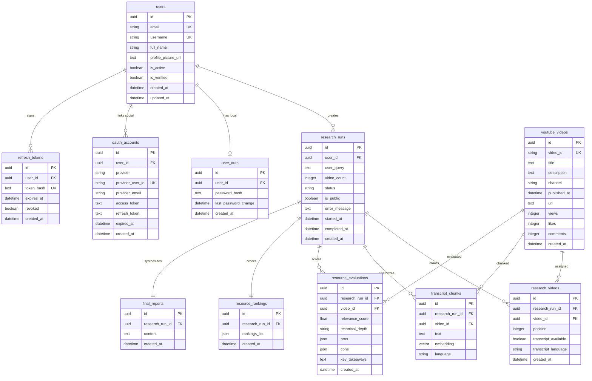
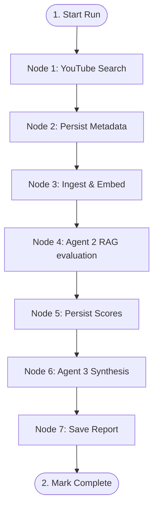

# ResearchTube Backend API Engine

Welcome to the backend server engine of **ResearchTube** — an automated, multi-agent research pipeline that crawls YouTube, extracts and embeds transcripts into a PostgreSQL database utilizing pgvector, evaluates content using RAG mechanics, and synthesizes publication-grade technical markdown reports.

This document covers the architectural design, database schemas, agent workflows, tool implementations, and details on how to set up and run the service locally.

---

## 🏗️ System Architecture & Tech Stack

The backend is built as an asynchronous Python application using a modern enterprise stack:

*   **API Framework:** `FastAPI` (asynchronous routing, dependency injection, automatic OpenAPI docs).
*   **Agentic Orchestration:** `LangGraph` (state-machine workflow definition, message handling, execution checkpoints).
*   **Language Models:** Google `Gemini 3.5 Flash` via the new `google-genai` SDK.
*   **Embeddings Generator:** Google `text-embedding-004` (generates 768-dimensional dense vectors).
*   **Database & Vector Engine:** `PostgreSQL` with the `pgvector` extension for semantic vector similarity searching.
*   **Object Relational Mapper:** `SQLAlchemy 2.0` (asynchronous engine using modern mapped columns typing).
*   **Security & Protection:** `slowapi` (FastAPI rate limiter implementing token bucket algorithms) and `pwdlib[argon2]` (secure credential hashing).
*   **Observability:** `structlog` (structured JSON logging optimized for GCP Cloud Logging).
*   **Efficiency:** `GZipMiddleware` (response compression cutting payload size by ~70% on large requests).

---

## 🗄️ Database Schema & Models

The database contains tables representing user profiles, local/social authentication accounts, and the complete research graph outputs.

### Entity-Relationship Diagram

The schema structure is fully relational with cascade rules and unique constraints. It renders in markdown via the following Mermaid notation:



### Table Details & Types

1.  **`users`:** Holds core profile metadata.
    *   `email`: Indexed, unique, mandatory.
    *   `username`: Unique, nullable.
2.  **`user_auth`:** Credentials repository for local logins.
    *   `user_id`: Unique foreign key pointing to `users.id` with `ondelete="CASCADE"`.
    *   `password_hash`: Argon2 ID string representation.
3.  **`oauth_accounts`:** Stores connected Google OAuth profiles.
    *   `provider`: Custom SQLAlchemy Enum (`local`, `google`).
    *   `provider_user_id`: Scoped ID returned by provider. Enforces `UniqueConstraint("provider", "provider_user_id")`.
4.  **`refresh_tokens`:** Manages refresh tokens for sliding sessions.
    *   `token_hash`: SHA-256 digested representation, unique.
5.  **`research_runs`:** Defines individual research jobs.
    *   `status`: String index representing graph progress (`pending`, `researching`, `ingesting`, `analyzing`, `reporting`, `completed`, `failed`).
    *   `is_public`: Indexed boolean determining shared route visibility.
6.  **`youtube_videos`:** Stores global video cache to prevent repetitive metadata scraping.
    *   `video_id`: Unique 11-character identifier (indexed).
7.  **`research_videos`:** Junction table linking videos to runs. Enforces `UniqueConstraint("research_run_id", "video_id")`.
8.  **`transcript_chunks`:** Contains embedded vectors.
    *   `embedding`: Data type `Vector(768)`. Uses PostgreSQL index `hnsw` or `ivfflat` (via pgvector) for Cosine Similarity search.
9.  **`resource_evaluations`:** Evaluated metrics produced by Agent 2.
    *   `pros` and `cons`: Native PostgreSQL JSON columns.
10. **`resource_rankings`:** Ordered result output generated from RAG score weighting.
11. **`final_reports`:** Houses synthesized Markdown files.

---

## 🤖 Multi-Agent Graph Orchestration

The research pipeline uses a state-machine architecture managed by `LangGraph` in [`youtube_graph.py`](file:///c:/Saket/Projects/ResearchTube/backend/app/graph/youtube_graph.py).



### The State Machine (`ResearchState`)
The state dictionary accumulates results as the execution moves between nodes:
```python
class ResearchState(TypedDict):
    user_query: str               # Raw input search term
    video_count: int              # Target video count (default: 3)
    research_run_id: str          # DB UUID string
    research_result: ResearchResult # Agent 1 crawled data output
    video_id_map: dict[str, str]  # YouTube ID -> DB UUID mapping
    analysis: list[VideoEvaluation] # Agent 2 scoring outputs
    final_report: str             # Agent 3 synthesized report
```

### Node Execution Steps

*   **Node 1: Agent 1 (YouTube Researcher)**
    *   *Agent:* [`youtube_research_agent.py`](file:///c:/Saket/Projects/ResearchTube/backend/app/agents/youtube_research_agent.py)
    *   *Action:* Receives query, calculates Google Search terms, executes API search tool, calls transcript tools, and formats structured metadata.
*   **Node 2: Persist Research**
    *   *Action:* Inserts unique videos into `youtube_videos`, registers links in `research_videos`, and maps IDs.
*   **Node 3: Ingest Transcripts (RAG Preparation)**
    *   *Action:* Parses available video transcripts, splits them into overlap segments, generates dense vectors utilizing `text-embedding-004`, and inserts them into `transcript_chunks`.
*   **Node 4: Agent 2 (RAG Context Evaluator)**
    *   *Agent:* [`youtube_context_analysis_agent.py`](file:///c:/Saket/Projects/ResearchTube/backend/app/agents/youtube_context_analysis_agent.py)
    *   *Action:* Runs semantic similarity queries on `transcript_chunks` using pgvector, pulls relevant context blocks, evaluates content accuracy/technical depth, and calculates a floating score.
*   **Node 5: Persist Analysis**
    *   *Action:* Saves evaluations to `resource_evaluations` and records rankings list.
*   **Node 6: Agent 3 (Synthesis & Reporting)**
    *   *Agent:* [`youtube_final_report_agent.py`](file:///c:/Saket/Projects/ResearchTube/backend/app/agents/youtube_final_report_agent.py)
    *   *Action:* Reads all evaluated video summaries, relevance logs, and original user query. It synthesizes a styled technical markdown summary.
*   **Node 7: Persist Report**
    *   *Action:* Writes Markdown to `final_reports` and sets status in `research_runs` to `completed`.

---

## 🛠️ Tool-Calling Proxy Pipeline

Outbound YouTube API and scraper requests are routed through a proxy-aware factory class in [`youtube_tools.py`](file:///c:/Saket/Projects/ResearchTube/backend/app/tools/youtube_tools.py) to resolve IP blockages:

1.  **Webshare Proxy Config:** Automatically instantiates `WebshareProxyConfig` if credentials exist in the environment variables.
2.  **Generic Proxy Config:** Dynamically injects proxy credentials and URL hosts into system `HTTP_PROXY`, `HTTPS_PROXY`, `http_proxy`, and `https_proxy` environment variables to force underlying HTTP clients (like `httpx` or `requests`) through the custom network route.
3.  **Language Tier Fallbacks:** Scrapes transcripts sequentially through primary English (`en`), english regional variants (`en-US`, `en-IN`, etc.), popular languages (`hi`, `es`, `fr`), and finally retrieves any available auto-generated tag to prevent empty data returns.

---

## 🚦 Router Registry & Middleware

### Core Middlewares
*   **Rate Limiting:** Managed using the decoded JWT payload `user_id` when authenticated (guaranteeing fair-use across multiple browser sessions) and client IP for public endpoints.
*   **GZip Response Compression:** Configured with `minimum_size=1000` to compress large history response buffers by ~70%.
*   **Structured Logger Middleware:** Logs every API response with HTTP verb, URL path, response status, and processing duration in milliseconds.

### API Endpoints

| Verb | Path | Protected? | Rate Limit | Purpose |
|---|---|---|---|---|
| **POST** | `/auth/register` | No | `5 / hour` | Account creation |
| **POST** | `/auth/login` | No | `10 / minute` | JWT authentication token exchange |
| **POST** | `/auth/refresh` | No | `30 / minute` | Rotate JWT tokens |
| **POST** | `/auth/logout` | No | `20 / minute` | Revoke active refresh token |
| **GET** | `/auth/google` | No | `10 / minute` | Initiates Google OAuth2 redirection |
| **GET** | `/auth/me` | Yes | `60 / minute` | Retrieve profile metadata |
| **PATCH** | `/auth/me` | Yes | `10 / minute` | Update profile details |
| **POST** | `/auth/change-password` | Yes | `5 / minute` | Update local account credentials |
| **POST** | `/youtube/research` | Yes | `5 / minute` | Start research execution graph |
| **GET** | `/youtube/history` | Yes | `60 / minute` | Paginated run history list |
| **GET** | `/youtube/history/{id}`| Yes | `60 / minute` | Fetch details of a single run |
| **DELETE**| `/youtube/history/{id}`| Yes | `20 / minute` | Remove a history record |
| **PATCH** | `/youtube/history/{id}/rename`| Yes | `20 / minute` | Rename user_query details of a run |
| **PATCH** | `/youtube/history/{id}/share`| Yes | `10 / minute` | Toggle public/private report visibility |
| **GET** | `/youtube/shared/{id}` | No | `30 / minute` | Retrieve public shared report |
| **GET** | `/user/stats` | Yes | `30 / minute` | Aggregate research statistics |
| **DELETE**| `/user/account` | Yes | `3 / hour` | Permanently delete user profile |

---

## ⚙️ Running Locally

### Prerequisites
Before running, you must create a configuration `.env` file containing API keys and OAuth tokens. 

> [!IMPORTANT]
> Detailed instructions on how to generate the Google Gemini API key, YouTube v3 API key, and Google OAuth credentials can be found in [`ENV_SETUP.md`](file:///c:/Saket/Projects/ResearchTube/backend/ENV_SETUP.md). **Do not copy credential generation steps into this configuration.**

```bash
cp .env.example .env
# Open .env and add your respective credential keys.
```

---

### Option A: Run via Docker Compose (Recommended)

1.  **Build and Start:**
    Start the Postgres database with pgvector and the FastAPI container in detached mode:
    ```bash
    docker compose up --build -d
    ```
2.  **Verify Status:**
    Ensure both containers are online:
    ```bash
    docker compose ps
    ```
3.  **Inspect Logs:**
    View container standard output (formatted as JSON):
    ```bash
    docker compose logs -f api
    ```

---

### Option B: Run Locally (Bare-metal Virtual Environment)

If you prefer running the FastAPI app directly on your host machine (for instance, to ease local hot-reloading debugging):

1.  **Configure PostgreSQL with pgvector:**
    Ensure you have a local PostgreSQL instance running and the `pgvector` extension installed. Create a database named `youtube_research`.
2.  **Create and Activate Virtual Environment:**
    ```bash
    python -m venv venv
    # Windows:
    .\venv\Scripts\activate
    # macOS/Linux:
    source venv/bin/activate
    ```
3.  **Install Dependencies:**
    ```bash
    pip install -r requirements.txt
    ```
4.  **Export Local Environment Variables:**
    Update `.env` to point `DATABASE_URL` to your local PostgreSQL instance:
    ```env
    DATABASE_URL=postgresql+asyncpg://<username>:<password>@localhost:5432/youtube_research
    ```
5.  **Start Dev Server:**
    Launch the FastAPI app with Uvicorn (hot-reload enabled):
    ```bash
    uvicorn app.main:app --host 127.0.0.1 --port 8000 --reload
    ```
    The API docs will be available at `http://127.0.0.1:8000/docs`.

---

## 🧪 Testing

The repository contains backend integration tests covering the proxy wrapper configurations, DB connections, and YouTube scraping pipelines.

*   **Run inside Docker:**
    ```bash
    docker compose exec api pytest app/tools/test_youtube_transcript.py
    ```
*   **Run locally:**
    ```bash
    pytest app/tools/test_youtube_transcript.py
    ```
