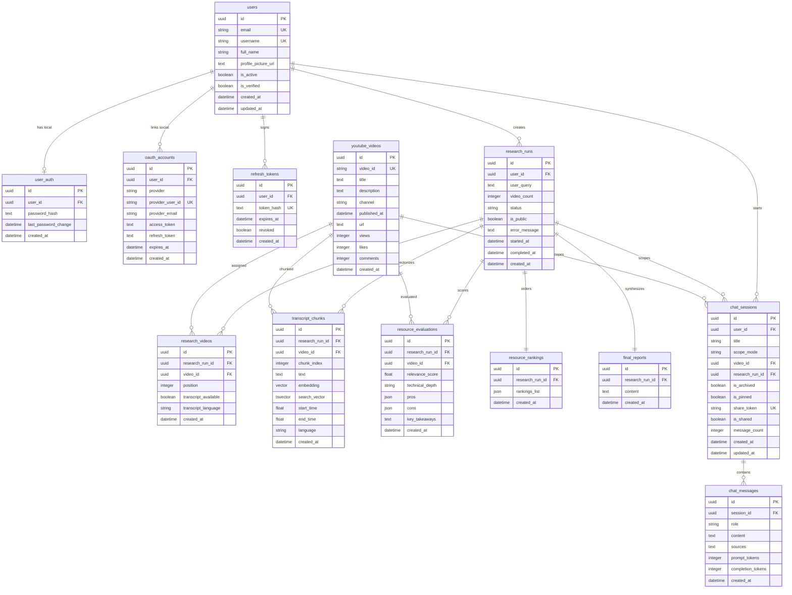
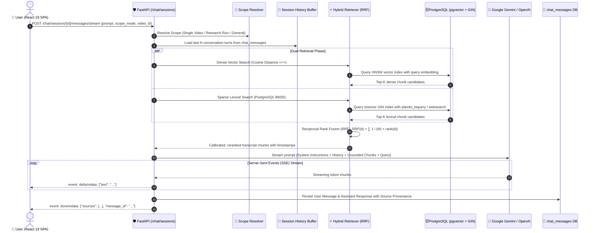
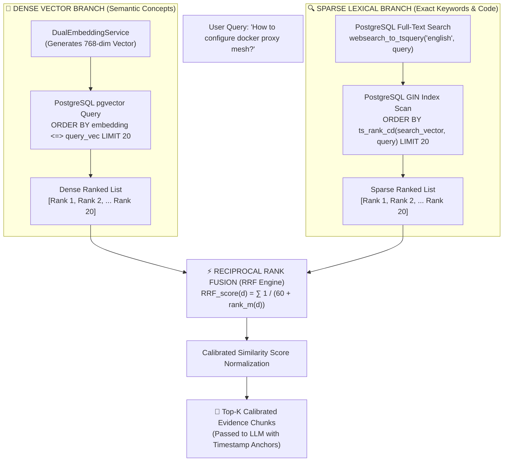

# ResearchTube Backend API Engine

Welcome to the backend server engine of **ResearchTube** — an automated, multi-agent research pipeline and conversational intelligence platform. The engine crawls YouTube, extracts transcripts through a resilient 3-layer proxy mesh, embeds chunks into PostgreSQL utilizing `pgvector` alongside full-text lexical indexing (`tsvector`), evaluates content via **Hybrid Search (BM25 + Dense Vectors via Reciprocal Rank Fusion)**, synthesizes publication-grade technical markdown reports, and streams real-time RAG-grounded discussions via Server-Sent Events (SSE).

This document covers the architectural design, database schemas, agent workflows, hybrid retrieval mechanics, conversational streaming engine, tool implementations, and comprehensive setup instructions.

---

## 🏗️ System Architecture & Tech Stack

The backend is built as an asynchronous Python application using a modern enterprise stack:

*   **API Framework:** `FastAPI` (asynchronous ASGI routing, dependency injection, automatic OpenAPI/Swagger documentation).
*   **Agentic Orchestration:** `LangGraph` (state-machine workflow definition, message handling, and execution checkpoints).
*   **Dual Intelligence Engines:**
    *   **Autonomous Research Pipeline:** 7-Node LangGraph DAG orchestrating 3 specialized agents to crawl, evaluate, and synthesize research reports.
    *   **Conversational Video RAG Assistant:** Multi-turn chat engine with dynamic scoping (`video`, `run`, `none`), session history buffering, and token-by-token SSE streaming.
*   **Hybrid Retrieval Engine:**
    *   **Dense Vectors:** PostgreSQL `pgvector` extension computing Cosine Distance (`<=>`) over 768-dimensional embeddings.
    *   **Sparse Lexical:** PostgreSQL native Full-Text Search with `tsvector`, Generalized Inverted Index (`GIN`), and Cover Density ranking (`ts_rank_cd`).
    *   **Rank Fusion:** Reciprocal Rank Fusion (`RRF`, $k=60$) combining semantic understanding with exact code/keyword matching.
*   **Embeddings & LLMs:**
    *   **DualEmbeddingService:** Resilient multi-provider embedding generator utilizing OpenAI `text-embedding-3-small` (primary) and Google `text-embedding-004` (fallback).
    *   **Language Models:** Google `Gemini 3.5 Flash` via `google-genai` with fallback support for OpenAI GPT-4o-mini.
*   **Object Relational Mapper:** `SQLAlchemy 2.0` (asynchronous engine using modern mapped columns typing).
*   **Security & Protection:** `slowapi` (FastAPI rate limiter implementing token bucket algorithms) and `pwdlib[argon2]` (secure credential hashing).
*   **Session Management:** JWT Access Tokens (30m) paired with SHA-256 hashed sliding Refresh Tokens (7–10 days).
*   **Observability:** `structlog` (structured JSON logging optimized for GCP Cloud Logging).
*   **Efficiency:** `GZipMiddleware` (response compression cutting payload size by ~70% on large requests).

---

## 🗄️ Database Schema & Models

The database contains tables representing user profiles, local/social authentication accounts, autonomous research graph artifacts, and multi-turn conversational chat sessions.

### Entity-Relationship Diagram

The schema structure is fully relational with foreign key cascades, unique constraints, and vector indexes:


```mermaid
erDiagram
    users {
        uuid id PK
        string email UK
        string username UK
        string full_name
        text profile_picture_url
        boolean is_active
        boolean is_verified
        datetime created_at
        datetime updated_at
    }

    user_auth {
        uuid id PK
        uuid user_id FK
        text password_hash
        datetime last_password_change
        datetime created_at
    }

    oauth_accounts {
        uuid id PK
        uuid user_id FK
        string provider
        string provider_user_id UK
        string provider_email
        text access_token
        text refresh_token
        datetime expires_at
        datetime created_at
    }

    refresh_tokens {
        uuid id PK
        uuid user_id FK
        text token_hash UK
        datetime expires_at
        boolean revoked
        datetime created_at
    }

    research_runs {
        uuid id PK
        uuid user_id FK
        text user_query
        integer video_count
        string status
        boolean is_public
        text error_message
        datetime started_at
        datetime completed_at
        datetime created_at
    }

    youtube_videos {
        uuid id PK
        string video_id UK
        text title
        text description
        string channel
        datetime published_at
        text url
        integer views
        integer likes
        integer comments
        datetime created_at
    }

    research_videos {
        uuid id PK
        uuid research_run_id FK
        uuid video_id FK
        integer position
        boolean transcript_available
        string transcript_language
        datetime created_at
    }

    transcript_chunks {
        uuid id PK
        uuid research_run_id FK
        uuid video_id FK
        integer chunk_index
        text text
        vector embedding
        tsvector search_vector
        float start_time
        float end_time
        string language
        datetime created_at
    }

    resource_evaluations {
        uuid id PK
        uuid research_run_id FK
        uuid video_id FK
        float relevance_score
        string technical_depth
        json pros
        json cons
        text key_takeaways
        datetime created_at
    }

    resource_rankings {
        uuid id PK
        uuid research_run_id FK
        json rankings_list
        datetime created_at
    }

    final_reports {
        uuid id PK
        uuid research_run_id FK
        text content
        datetime created_at
    }

    chat_sessions {
        uuid id PK
        uuid user_id FK
        string title
        string scope_mode
        uuid video_id FK
        uuid research_run_id FK
        boolean is_archived
        boolean is_pinned
        string share_token UK
        boolean is_shared
        integer message_count
        datetime created_at
        datetime updated_at
    }

    chat_messages {
        uuid id PK
        uuid session_id FK
        string role
        text content
        text sources
        integer prompt_tokens
        integer completion_tokens
        datetime created_at
    }

    users ||--o{ research_runs : "creates"
    users ||--o| user_auth : "has local"
    users ||--o{ oauth_accounts : "links social"
    users ||--o{ refresh_tokens : "signs"
    users ||--o{ chat_sessions : "starts"
    
    research_runs ||--o{ research_videos : "crawls"
    research_runs ||--o{ transcript_chunks : "vectorizes"
    research_runs ||--o{ resource_evaluations : "scores"
    research_runs ||--|| resource_rankings : "orders"
    research_runs ||--|| final_reports : "synthesizes"
    research_runs ||--o{ chat_sessions : "scopes"

    youtube_videos ||--o{ research_videos : "assigned"
    youtube_videos ||--o{ transcript_chunks : "chunked"
    youtube_videos ||--o{ resource_evaluations : "evaluated"
    youtube_videos ||--o{ chat_sessions : "scopes"

    chat_sessions ||--o{ chat_messages : "contains"
```

### Table Details & Types

1.  **`users`:** Holds core profile metadata.
    *   `email`: Indexed, unique, mandatory.
    *   `username`: Unique, nullable.
2.  **`user_auth`:** Credentials repository for local logins.
    *   `user_id`: Unique foreign key pointing to `users.id` with `ondelete="CASCADE"`.
    *   `password_hash`: Argon2 ID string representation.
3.  **`oauth_accounts`:** Stores connected Google OAuth profiles.
    *   `provider`: Custom SQLAlchemy Enum (`local`, `google`).
    *   `provider_user_id`: Scoped ID returned by provider. Enforces `UniqueConstraint("provider", "provider_user_id")`.
4.  **`refresh_tokens`:** Manages refresh tokens for sliding sessions.
    *   `token_hash`: SHA-256 digested representation, unique.
    *   `expires_at`: Sliding 7–10 day expiry window.
5.  **`research_runs`:** Defines individual research jobs.
    *   `status`: String index representing graph progress (`pending`, `researching`, `ingesting`, `analyzing`, `reporting`, `completed`, `failed`).
    *   `is_public`: Indexed boolean determining shared route visibility.
6.  **`youtube_videos`:** Stores global video cache to prevent repetitive metadata scraping.
    *   `video_id`: Unique 11-character identifier (indexed).
7.  **`research_videos`:** Junction table linking videos to runs. Enforces `UniqueConstraint("research_run_id", "video_id")`.
8.  **`transcript_chunks`:** Contains embedded vectors and lexical tokens.
    *   `embedding`: Data type `Vector(768)`. Uses PostgreSQL index `hnsw` or `ivfflat` (via pgvector) for Cosine Similarity search.
    *   `search_vector`: PostgreSQL `tsvector` with GIN indexing for high-speed lexical search.
    *   `start_time` & `end_time`: Second-level timestamps for precise video anchoring in RAG responses.
9.  **`resource_evaluations`:** Evaluated metrics produced by Agent 2.
    *   `pros` and `cons`: Native PostgreSQL JSON columns.
10. **`resource_rankings`:** Ordered result output generated from RAG score weighting.
11. **`final_reports`:** Houses synthesized Markdown files.
12. **`chat_sessions`:** Persistent multi-turn conversation threads.
    *   `scope_mode`: Scope type string (`none`, `video`, `run`).
    *   `video_id` / `research_run_id`: Nullable foreign keys defining retrieval boundaries.
    *   `is_pinned` & `is_archived`: Session organization flags.
    *   `share_token`: Unique 64-character token for public conversation access.
13. **`chat_messages`:** Individual turns within a session.
    *   `role`: Enum (`user`, `assistant`, `system`).
    *   `content`: Raw markdown conversation text.
    *   `sources`: JSON-encoded provenance array containing chunk IDs, video titles, and timestamps.

---

## 🤖 Multi-Agent Graph Orchestration (7-Node LangGraph DAG)

The research pipeline uses a state-machine architecture managed by `LangGraph` in [`youtube_graph.py`](file:///c:/Saket/Projects/ResearchTube/backend/app/graph/youtube_graph.py).


```mermaid
flowchart LR
    Start([🚀 User Query]) --> N1["Node 1: Validator\n(Sanitize Query & Quotas)"]
    N1 --> N2["Node 2: Query Planner\n(Agent 1: 3-5 Sub-queries)"]
    N2 --> N3["Node 3: YouTube Proxy Scraper\n(Agent 1: 3-Layer Proxy Mesh)"]
    N3 --> N4["Node 4: Transcript Chunker & Ingest\n(Sliding Window: W=1000, O=150)"]
    N4 --> N5["Node 5: Hybrid RAG Evaluator\n(Agent 2: Dense + BM25 Scoring)"]
    N5 --> N6["Node 6: Synthesizer Engine\n(Agent 3: Markdown & Knowledge Graph)"]
    N6 --> N7["Node 7: Transactional Persistence\n(PostgreSQL Atomic Commit)"]
    N7 --> End([📄 Publication-Ready Report & 2D Graph])

    classDef agent fill:#161616,stroke:#3b82f6,stroke-width:1.5px,color:#ffffff;
    classDef node fill:#111111,stroke:#262626,stroke-width:1px,color:#cccccc;
    class N2,N3,N5,N6 agent;
    class N1,N4,N7 node;
```

### The State Machine (`ResearchState`)

The state dictionary accumulates results as the execution moves between nodes:

```python
class ResearchState(TypedDict):
    user_query: str                  # Raw input search term
    video_count: int                 # Target video count (default: 3)
    research_run_id: str             # DB UUID string
    research_result: ResearchResult  # Agent 1 crawled data output
    video_id_map: dict[str, str]     # YouTube ID -> DB UUID mapping
    analysis: list[VideoEvaluation]  # Agent 2 scoring outputs
    final_report: str                # Agent 3 synthesized report
```

### Node Execution Steps

*   **Node 1: Validator & Rate Limiter**
    *   *Action:* Validates input query syntax, checks authenticated user quota, and initializes database run record with status `researching`.
*   **Node 2: Agent 1 (Query Planner)**
    *   *Agent:* [`youtube_research_agent.py`](file:///c:/Saket/Projects/ResearchTube/backend/app/agents/youtube_research_agent.py)
    *   *Action:* Deconstructs the research topic into 3–5 targeted sub-queries optimized for technical depth, architectural overviews, and implementation tutorials.
*   **Node 3: Agent 1 (YouTube Scraper & Proxy Mesh)**
    *   *Agent:* [`youtube_tools.py`](file:///c:/Saket/Projects/ResearchTube/backend/app/tools/youtube_tools.py)
    *   *Action:* Dispatches API searches and extracts video transcripts via a 3-layer proxy resilience mesh (Webshare residential pool, environment proxies, sequential language fallbacks).
*   **Node 4: Ingest & Sliding Window Chunker**
    *   *Action:* Splits raw transcripts into 1,000-character windows with a 150-character overlap, generates 768-dimensional dense vectors via `DualEmbeddingService`, builds `tsvector` lexical tokens, and persists them into `transcript_chunks`.
*   **Node 5: Agent 2 (Hybrid RAG Evaluator)**
    *   *Agent:* [`youtube_context_analysis_agent.py`](file:///c:/Saket/Projects/ResearchTube/backend/app/agents/youtube_context_analysis_agent.py)
    *   *Action:* Queries PostgreSQL using `YouTubeTranscriptRetriever` (combining dense vector cosine distance and lexical BM25 via RRF), grades each video on relevance, technical depth, pros, cons, and key takeaways.
*   **Node 6: Agent 3 (Synthesis & Reporting)**
    *   *Agent:* [`youtube_final_report_agent.py`](file:///c:/Saket/Projects/ResearchTube/backend/app/agents/youtube_final_report_agent.py)
    *   *Action:* Analyzes all scored video summaries, relevance matrices, and user questions. Synthesizes a structured technical markdown report and constructs the 2D interactive knowledge graph nodes.
*   **Node 7: Transactional Persistence**
    *   *Action:* Writes Markdown to `final_reports`, records `resource_evaluations` and `resource_rankings`, and marks `research_runs.status = "completed"` in a single atomic database commit.

---

## 💬 Conversational Video RAG Chat Engine & Streaming Architecture

ResearchTube includes a conversational intelligence engine that allows users to ask questions grounded directly in researched YouTube video transcripts with source citations and real-time Server-Sent Events (SSE) streaming.

### Sequence Flow Diagram


```mermaid
sequenceDiagram
    autonumber
    actor User as 👤 User (React 19 SPA)
    participant ChatAPI as 🛡️ FastAPI (/chat/sessions)
    participant Scope as 🎯 Scope Resolver
    participant History as 📜 Session History Buffer
    participant Hybrid as ⚡ Hybrid Retriever (RRF)
    participant PG as 🗄️ PostgreSQL (pgvector + GIN)
    participant LLM as 🤖 Google Gemini / OpenAI
    participant DB as 💾 chat_messages DB

    User->>ChatAPI: POST /chat/sessions/{id}/messages/stream (prompt, scope_mode, video_id)
    ChatAPI->>Scope: Resolve Scope (Single Video / Research Run / General)
    ChatAPI->>History: Load last N conversation turns from chat_messages
    
    par Dual Retrieval Phase
        ChatAPI->>Hybrid: Dense Vector Search (Cosine Distance <=>)
        Hybrid->>PG: Query HNSW vector index with query embedding
        PG-->>Hybrid: Top-K dense chunk candidates
    and
        ChatAPI->>Hybrid: Sparse Lexical Search (PostgreSQL BM25)
        Hybrid->>PG: Query tsvector GIN index with plainto_tsquery / websearch
        PG-->>Hybrid: Top-K lexical chunk candidates
    end

    Hybrid->>Hybrid: Reciprocal Rank Fusion (RRF): RRF(d) = ∑ 1 / (60 + rank(d))
    Hybrid-->>ChatAPI: Calibrated, reranked transcript chunks with timestamps

    ChatAPI->>LLM: Stream prompt (System Instructions + History + Grounded Chunks + Query)
    
    loop Server-Sent Events (SSE) Stream
        LLM-->>ChatAPI: Streaming token chunks
        ChatAPI-->>User: event: delta\ndata: {"text": "..."}
    end

    ChatAPI->>DB: Persist User Message & Assistant Response with Source Provenance
    ChatAPI-->>User: event: done\ndata: {"sources": [...], "message_id": "..."}
```

### Scope Resolution Modes

The chat engine supports three retrieval scopes defined in `scope_mode`:

1.  **`video` (Single Video Scope):** Retrieval is strictly bounded to `video_id`. Answers reference only the specified YouTube video with second-level timestamp anchors.
2.  **`run` (Research Run Scope):** Retrieval searches across all videos gathered during a specific research run (`research_run_id`), synthesizing cross-video insights.
3.  **`none` (General Library Scope):** Retrieval queries across all user-researched videos in the library, or acts as a general AI assistant when no matches are found.

### Server-Sent Events (SSE) Protocol

Streaming endpoints yield structured events:

| Event Type | Payload Content | Purpose |
| :--- | :--- | :--- |
| `event: user` | `{"id": "...", "content": "..."}` | Confirms user message persistence in DB |
| `event: sources` | `[{"chunk_id": "...", "title": "...", "start_time": 120, ...}]` | Grounded transcript evidence snippets |
| `event: delta` | `{"text": "..."}` | Real-time token delta generated by LLM |
| `event: done` | `{"id": "...", "content": "...", "sources": [...]}` | Final assistant message record with metadata |
| `event: error` | `{"message": "..."}` | Runtime execution exception reporting |

---

## ⚡ Hybrid Retrieval Engine (BM25 + pgvector + RRF)

Traditional vector search excels at high-level semantic abstractions but often struggles with exact code identifiers, CLI flags (e.g. `--build`, `alembic upgrade head`), and technical terminology. Conversely, pure keyword search fails on paraphrasing, conceptual inquiries, and synonyms.

ResearchTube implements **Hybrid Search** combining dense vector semantics with sparse full-text lexical matching via **Reciprocal Rank Fusion (RRF)**:


```mermaid
flowchart TD
    Q["User Query: 'How to configure docker proxy mesh?'"]

    subgraph DenseBranch["🧠 DENSE VECTOR BRANCH (Semantic Concepts)"]
        Emb["DualEmbeddingService\n(Generates 768-dim Vector)"]
        HNSW["PostgreSQL pgvector Query\nORDER BY embedding <=> query_vec LIMIT 20"]
        DenseList["Dense Ranked List\n[Rank 1, Rank 2, ... Rank 20]"]
        Emb --> HNSW --> DenseList
    end

    subgraph SparseBranch["🔍 SPARSE LEXICAL BRANCH (Exact Keywords & Code)"]
        FTS["PostgreSQL Full-Text Search\nwebsearch_to_tsquery('english', query)"]
        GIN["PostgreSQL GIN Index Scan\nORDER BY ts_rank_cd(search_vector, query) LIMIT 20"]
        SparseList["Sparse Ranked List\n[Rank 1, Rank 2, ... Rank 20]"]
        FTS --> GIN --> SparseList
    end

    DenseList --> RRFMerge["⚡ RECIPROCAL RANK FUSION (RRF Engine)\nRRF_score(d) = ∑ 1 / (60 + rank_m(d))"]
    SparseList --> RRFMerge

    RRFMerge --> Calibrate["Calibrated Similarity Score Normalization"]
    Calibrate --> FinalTopK["🎯 Top-K Calibrated Evidence Chunks\n(Passed to LLM with Timestamp Anchors)"]
```

### Mathematical Formulation

Given a document $d$, dense rank $r_{\text{dense}}(d)$, and lexical rank $r_{\text{sparse}}(d)$, the RRF score is defined as:

$$RRF(d) = \sum_{m \in \{\text{dense}, \text{sparse}\}} \frac{1}{k + r_m(d)}$$

where $k = 60$ is the standard smoothing constant. To maintain backward compatibility with downstream similarity filters, the fused score is normalized into a calibrated $[0, 1]$ interval:

$$\text{Similarity}_{\text{calibrated}} = 0.50 + 0.35 \times \left(1.0 - \frac{\text{rank}_{\text{fused}} - 1}{K_{\text{candidates}}}\right)$$

---

## 🛠️ Tool-Calling Proxy Pipeline

Outbound YouTube API and scraper requests are routed through a proxy-aware factory class in [`youtube_tools.py`](file:///c:/Saket/Projects/ResearchTube/backend/app/tools/youtube_tools.py) to resolve IP blockages:

1.  **Webshare Residential Proxy Config:** Automatically instantiates `WebshareProxyConfig` if credentials exist in the environment variables.
2.  **Generic Proxy Config:** Dynamically injects proxy credentials and URL hosts into system `HTTP_PROXY`, `HTTPS_PROXY`, `http_proxy`, and `https_proxy` environment variables to force underlying HTTP clients (like `httpx` or `requests`) through the custom network route.
3.  **Language Tier Fallbacks:** Scrapes transcripts sequentially through primary English (`en`), english regional variants (`en-US`, `en-IN`, etc.), popular languages (`hi`, `es`, `fr`), and finally retrieves any available auto-generated tag to prevent empty data returns.

---

## 🚦 Router Registry & Middleware

### Core Middlewares
*   **Rate Limiting:** Managed using the decoded JWT payload `user_id` when authenticated (guaranteeing fair-use across multiple browser sessions) and client IP for public endpoints.
*   **GZip Response Compression:** Configured with `minimum_size=1000` to compress large history response buffers by ~70%.
*   **Structured Logger Middleware:** Logs every API response with HTTP verb, URL path, response status, and processing duration in milliseconds.

### API Endpoints

| Verb | Path | Protected? | Rate Limit | Purpose |
|---|---|---|---|---|
| **POST** | `/auth/register` | No | `5 / hour` | Account creation |
| **POST** | `/auth/login` | No | `10 / minute` | JWT authentication token exchange |
| **POST** | `/auth/refresh` | No | `30 / minute` | Rotate JWT access and sliding refresh tokens |
| **POST** | `/auth/logout` | No | `20 / minute` | Revoke active refresh token |
| **GET** | `/auth/google` | No | `10 / minute` | Initiates Google OAuth2 redirection |
| **GET** | `/auth/me` | Yes | `60 / minute` | Retrieve profile metadata |
| **PATCH** | `/auth/me` | Yes | `10 / minute` | Update profile details |
| **POST** | `/auth/change-password` | Yes | `5 / minute` | Update local account credentials |
| **POST** | `/youtube/research` | Yes | `5 / minute` | Start multi-agent research execution graph |
| **GET** | `/youtube/history` | Yes | `60 / minute` | Paginated research run history list |
| **GET** | `/youtube/history/{id}`| Yes | `60 / minute` | Fetch details of a single research run |
| **DELETE**| `/youtube/history/{id}`| Yes | `20 / minute` | Remove a history record |
| **PATCH** | `/youtube/history/{id}/rename`| Yes | `20 / minute` | Rename user_query details of a run |
| **PATCH** | `/youtube/history/{id}/share`| Yes | `10 / minute` | Toggle public/private report visibility |
| **GET** | `/youtube/shared/{id}` | No | `30 / minute` | Retrieve public shared research report |
| **GET** | `/chat/greeting` | No | `60 / minute` | Personalized welcome greeting for chat UI |
| **GET** | `/chat/available-videos` | Yes | `30 / minute` | List user's researched videos for chat scope picker |
| **POST** | `/chat/sessions` | Yes | `20 / minute` | Create new conversational RAG thread |
| **GET** | `/chat/sessions` | Yes | `60 / minute` | List user conversation threads (with scope badges) |
| **GET** | `/chat/sessions/{id}` | Yes | `60 / minute` | Fetch session details and complete message history |
| **PATCH** | `/chat/sessions/{id}` | Yes | `30 / minute` | Update title, pin state, or archive status |
| **DELETE** | `/chat/sessions/{id}` | Yes | `20 / minute` | Delete conversation and cascade messages |
| **PATCH** | `/chat/sessions/{id}/scope` | Yes | `30 / minute` | Dynamically update active video/run scope |
| **POST** | `/chat/sessions/{id}/messages` | Yes | `15 / minute` | Send message and receive RAG grounded reply (REST) |
| **POST** | `/chat/sessions/{id}/messages/stream` | Yes | `15 / minute` | Send message and stream reply via Server-Sent Events (SSE) |
| **POST** | `/chat/sessions/{id}/share` | Yes | `20 / minute` | Generate public share link for chat session |
| **DELETE** | `/chat/sessions/{id}/share` | Yes | `20 / minute` | Revoke public access token for chat session |
| **GET** | `/chat/shared/{token}` | No | `60 / minute` | View publicly shared conversation thread |
| **POST** | `/chat/shared/{token}/fork` | Yes | `10 / minute` | Fork public conversation into user's account |
| **GET** | `/user/stats` | Yes | `30 / minute` | Aggregate unified research & chat intelligence statistics |
| **DELETE**| `/user/account` | Yes | `3 / hour` | Permanently delete user profile and all associated data |

---

## ⚙️ Running Locally

### Prerequisites
Before running, you must create a configuration `.env` file containing API keys and OAuth tokens. 

> [!IMPORTANT]
> Detailed instructions on how to generate the Google Gemini API key, YouTube v3 API key, and Google OAuth credentials can be found in [`ENV_SETUP.md`](file:///c:/Saket/Projects/ResearchTube/backend/ENV_SETUP.md). **Do not copy credential generation steps into this configuration.**

```bash
cp .env.example .env
# Open .env and add your respective credential keys.
```

---

### Option A: Run via Docker Compose (Recommended)

1.  **Build and Start:**
    Start the Postgres database with pgvector and the FastAPI container in detached mode:
    ```bash
    docker compose up --build -d
    ```
2.  **Verify Status:**
    Ensure both containers are online:
    ```bash
    docker compose ps
    ```
3.  **Inspect Logs:**
    View container standard output (formatted as JSON):
    ```bash
    docker compose logs -f api
    ```

---

### Option B: Run Locally (Bare-metal Virtual Environment)

If you prefer running the FastAPI app directly on your host machine (for instance, to ease local hot-reloading debugging):

1.  **Configure PostgreSQL with pgvector:**
    Ensure you have a local PostgreSQL instance running and the `pgvector` extension installed. Create a database named `youtube_research`.
2.  **Create and Activate Virtual Environment:**
    ```bash
    python -m venv venv
    # Windows:
    .\venv\Scripts\activate
    # macOS/Linux:
    source venv/bin/activate
    ```
3.  **Install Dependencies:**
    ```bash
    pip install -r requirements.txt
    ```
4.  **Export Local Environment Variables:**
    Update `.env` to point `DATABASE_URL` to your local PostgreSQL instance:
    ```env
    DATABASE_URL=postgresql+asyncpg://<username>:<password>@localhost:5432/youtube_research
    ```
5.  **Start Dev Server:**
    Launch the FastAPI app with Uvicorn (hot-reload enabled):
    ```bash
    uvicorn app.main:app --host 127.0.0.1 --port 8000 --reload
    ```
    The API docs will be available at `http://127.0.0.1:8000/docs`.

---

## 🧪 Testing

The repository contains backend integration tests covering the proxy wrapper configurations, DB connections, and YouTube scraping pipelines.

*   **Run inside Docker:**
    ```bash
    docker compose exec api pytest app/tools/test_youtube_transcript.py
    ```
*   **Run locally:**
    ```bash
    pytest app/tools/test_youtube_transcript.py
    ```
