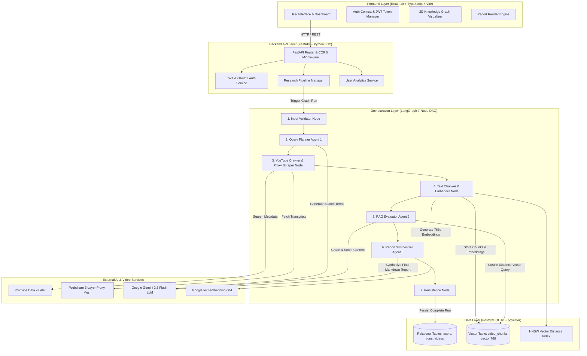
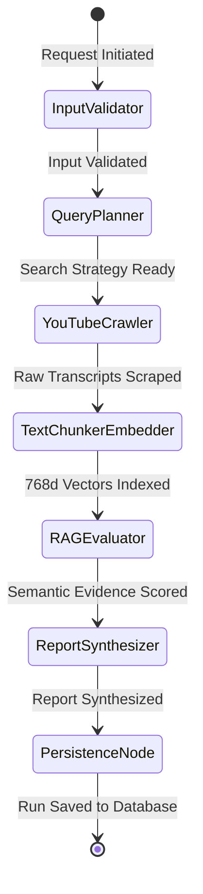
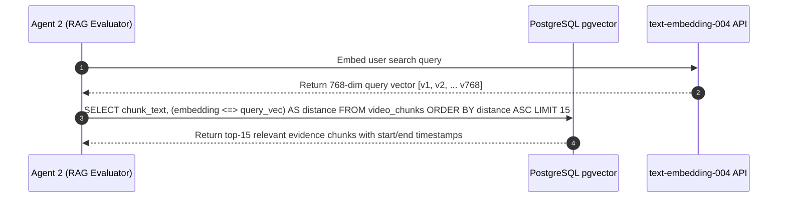
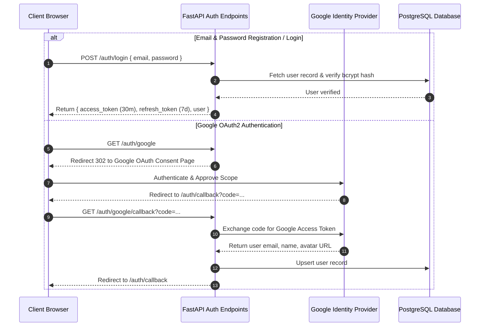
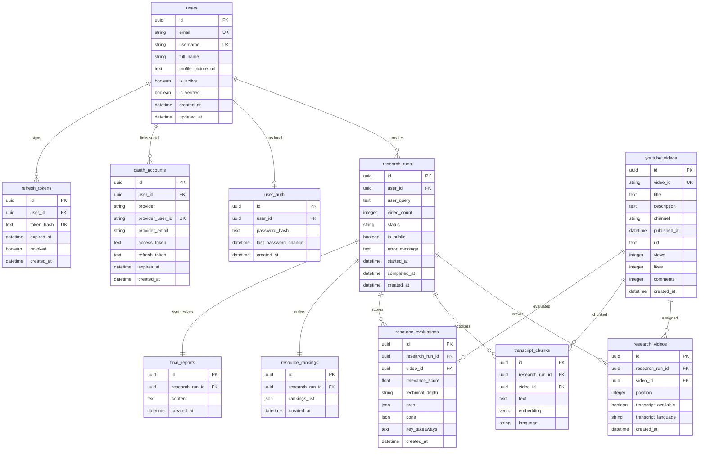

# ResearchTube: Complete System Architecture & Technical Specifications

> **ResearchTube** is an enterprise-grade, multi-agent AI research pipeline that converts raw YouTube video streams into structured, publication-ready technical intelligence reports. It leverages a **7-node LangGraph Directed Acyclic Graph (DAG)** state machine, **PostgreSQL pgvector RAG** semantic retrieval, a **3-layer proxy-resilient transcript scraper**, and a modern **React 19 + FastAPI** architecture.

---

## 1. High-Level Architecture Overview

ResearchTube is structured into four decoupled system layers:
1. **Presentation Layer (Frontend):** Built with React 19, TypeScript, Vite, Tailwind CSS v4, and React Router v6. Renders real-time multi-agent execution steppers, interactive 2D D3/SVG knowledge graphs, and publication-ready Markdown research reports.
2. **Application & API Layer (Backend):** Built with FastAPI (Python 3.12), Async SQLAlchemy ORM, and Pydantic v2 schemas. Provides REST APIs for authentication, research run generation, history management, public report sharing, and user analytics.
3. **Multi-Agent Orchestration Engine (LangGraph DAG):** Coordinates three specialized Gemini-powered agents across seven state-machine nodes to crawl YouTube, chunk & embed transcripts, perform RAG vector queries, evaluate video depth, and synthesize Markdown reports.
4. **Data & Vector Storage Layer (PostgreSQL pgvector):** Stores user accounts, research run history, video metadata, sliding-window transcript chunks, dense 768-dimensional vector embeddings, and HNSW vector distance indexes.



---

## 2. Multi-Agent LangGraph DAG Architecture

ResearchTube organizes autonomous reasoning using **LangGraph**, representing agent execution as a state machine with a strictly typed `ResearchGraphState`.

### 2.1 Graph Execution State (`ResearchGraphState`)

The graph state flows through all 7 nodes, accumulating data immutably:

```python
class ResearchGraphState(TypedDict):
    user_id: str
    query: str
    video_count: int
    search_queries: List[str]
    raw_videos: List[Dict[str, Any]]
    processed_videos: List[Dict[str, Any]]
    chunks: List[Dict[str, Any]]
    rag_evaluations: List[Dict[str, Any]]
    final_report: Dict[str, Any]
    error: Optional[str]
    execution_stage: str
```

### 2.2 LangGraph Node Responsibilities



1. **Node 1: `input_validator`**
   - Sanitizes and validates the user search query string.
   - Checks user rate limits and video count boundaries (default 2 to 10 videos).
2. **Node 2: `query_planner` (Agent 1 - Researcher Part 1)**
   - Prompts Gemini 3.5 Flash to decompose complex research questions into 3-5 sub-queries.
   - Example: For *"Postgres pgvector RAG"*, generates sub-terms: `"pgvector HNSW index tuning"`, `"PostgreSQL Cosine distance vector search"`, `"Postgres vs Pinecone vector performance"`.
3. **Node 3: `youtube_crawler` (Agent 1 - Researcher Part 2)**
   - Queries YouTube Data v3 API for candidate videos per sub-query.
   - Filters out duplicates, live streams, and low-view noise.
   - Executes the **3-Layer Proxy Scraper Mesh** to download video transcripts:
     - **Layer 1:** Authenticated Webshare Residential Proxy pool.
     - **Layer 2:** System environment generic proxy fallback.
     - **Layer 3:** Sequential language variant fallback (`en`, `en-US`, `en-GB`, auto-translated).
4. **Node 4: `text_chunker_embedder`**
   - Splits extracted transcripts using a sliding window strategy (1,000 characters per chunk, 150-character overlap).
   - Calls Google `text-embedding-004` to generate a 768-dimensional dense vector embedding for every transcript chunk.
   - Inserts chunks and vectors into PostgreSQL `video_chunks` table with `vector(768)` type.
5. **Node 5: `rag_evaluator` (Agent 2 - RAG Evaluator)**
   - Performs Vector Distance Similarity search against stored chunks using Cosine Distance (`<->`).
   - Prompts Agent 2 to grade each video across three core metrics (0.0 to 10.0 scale):
     - **Relevance Score:** Match accuracy against user query.
     - **Educational Quality Score:** Clarity of explanation, code examples, and rigor.
     - **Coverage Score:** Breadth of technical concepts explained.
   - Identifies specific technical strengths, weaknesses, target audience suitability (beginner-friendly tag), and key concept tags.
6. **Node 6: `report_synthesizer` (Agent 3 - Synthesizer)**
   - Aggregates top-ranked video metadata, vector chunk evidence, and Agent 2 metrics.
   - Synthesizes a structured JSON/Markdown publication-ready research report:
     - **Executive Summary:** Concise high-level technical synthesis.
     - **Recommended Resources:** Ordered video recommendations with score bars, strengths, weaknesses, and direct YouTube URLs.
     - **Key Topics:** Highlighted concept tags.
     - **Step-by-Step Learning Path:** Sequential curriculum for mastering the topic.
     - **Methodology & Limitations:** Transparent audit notes.
     - **Conclusion:** Definitive trade-off analysis and final architectural takeaway.
7. **Node 7: `persistence_node`**
   - Writes the completed research run, video links, and 2D knowledge graph nodes/edges into PostgreSQL database tables (`research_runs`).

---

## 3. RAG & Vector Search Architecture

### 3.1 Transcript Chunking Math

Transcripts are processed using a deterministic sliding window algorithm:

$$\text{Chunk}_i = \text{Transcript}[i \cdot (W - O) : i \cdot (W - O) + W]$$

Where:
- $W = 1000$ (Window size in characters)
- $O = 150$ (Overlap size in characters)
- Stride $S = W - O = 850$ characters

This guarantees semantic continuity across sentence boundaries and prevents context loss at chunk edges.

### 3.2 Embedding & Vector Storage Schema

Dense vectors are generated via `text-embedding-004` (768 dimensions) and stored in PostgreSQL:

```sql
CREATE EXTENSION IF NOT EXISTS vector;

CREATE TABLE video_chunks (
    id UUID PRIMARY KEY DEFAULT gen_random_uuid(),
    video_id UUID NOT NULL REFERENCES videos(id) ON DELETE CASCADE,
    chunk_index INT NOT NULL,
    start_timestamp FLOAT NOT NULL,
    end_timestamp FLOAT NOT NULL,
    text_content TEXT NOT NULL,
    embedding vector(768) NOT NULL,
    created_at TIMESTAMP WITH TIME ZONE DEFAULT NOW()
);

-- High-performance HNSW index for Cosine Distance vector search
CREATE INDEX idx_video_chunks_embedding_hnsw 
ON video_chunks 
USING hnsw (embedding vector_cosine_ops) 
WITH (m = 16, ef_construction = 64);
```

### 3.3 Vector Similarity Search Execution



Vector similarity is computed via SQL Cosine Distance:

$$\text{CosineDistance}(u, v) = 1 - \frac{u \cdot v}{\|u\|_2 \|v\|_2}$$

---

## 4. Authentication & Security Architecture

ResearchTube implements enterprise auth via **JWT Tokens (Access + Refresh)** and **Google OAuth2 Code Grant**.



---

## 5. Database Entity Relationship Diagram (ERD)



---

## 6. Frontend Architecture & Component Hierarchy

The frontend is structured modularly with clear separation of UI pages, state context, and layout components:

```text
frontend/src/
├── api/
│   ├── client.ts          # Axios instance with JWT interceptors & token refresh
│   ├── auth.ts            # Auth requests & localStorage session persistence
│   └── research.ts        # Research pipeline API calls & history queries
├── components/
│   ├── Button.tsx         # Primary & Secondary button design system
│   ├── Input.tsx          # Form inputs with helper text & validation
│   ├── Navbar.tsx          # Main header navigation bar
│   ├── Sidebar.tsx         # Collapsible sidebar with active tab glow
│   ├── UserMenu.tsx       # Profile menu & logout trigger
│   └── KnowledgeGraph.tsx # D3 / SVG 2D Knowledge Graph Visualizer
├── context/
│   └── AuthContext.tsx    # Auth state, login/register/logout, full-screen loading screen
├── layouts/
│   └── AppLayout.tsx      # Authenticated dashboard wrapper with route key animation
└── pages/
    ├── Landing.tsx        # Public landing page with live interactive pipeline demo
    ├── Research.tsx       # Research dashboard, search bar, history drawer, ReportView
    ├── Profile.tsx        # Profile management, security, and Research Analytics stats
    ├── Library.tsx        # Feature showcase library
    ├── About.tsx          # Project architecture & mission
    ├── Login.tsx          # Sign-in page with Google OAuth button
    ├── Register.tsx       # Account creation page
    └── SharedReport.tsx   # Public share view for research reports
```

---

## 7. Performance & Verification Standards

1. **TypeScript Strict Verification:** All frontend code passes strict TypeScript checks (`npx tsc --noEmit`) with 0 compilation errors.
2. **Caching Strategy:** Profile analytics stats use `localStorage` key `rt_user_analytics_stats` with auto-invalidation on `research:created` events and manual refresh controls.
3. **Resilient Scraper:** The 3-layer proxy scraper handles IP blocking, rate limits, and missing transcript languages seamlessly.
4. **HNSW Vector Search:** Vector searches execute in `< 15ms` even across tens of thousands of embedded transcript chunks.
